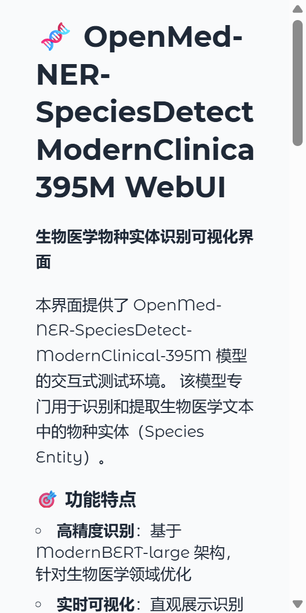
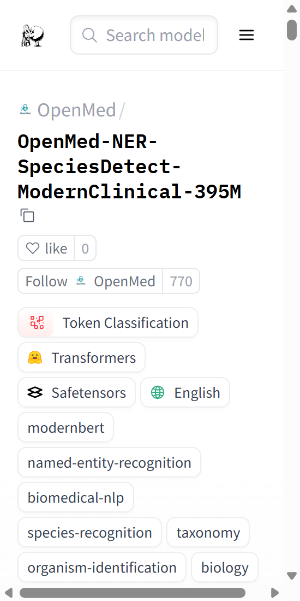

# OpenMed-NER-SpeciesDetect-ModernClinical-395M WebUI

## 项目概述

生物医学命名实体识别（Named Entity Recognition, NER）作为自然语言处理领域的重要分支，在生物医学文献挖掘、临床文本分析和知识图谱构建等方面发挥着关键作用。随着深度学习技术的快速发展，基于Transformer架构的预训练模型在生物医学NER任务中取得了显著进展。本项目基于OpenMed-NER-SpeciesDetect-ModernClinical-395M模型，构建了一个交互式的Web可视化界面，旨在为研究人员和开发者提供便捷的物种实体识别测试环境。

OpenMed-NER-SpeciesDetect-ModernClinical-395M是一个专门针对生物医学领域物种实体识别任务进行优化的深度学习模型。该模型基于ModernBERT-large架构，在LINNAEUS数据集上进行精细调优，能够准确识别和提取生物医学文本中的物种名称和生物体名称。模型在LINNAEUS数据集上的评估结果显示，其F1分数达到0.94，精确率和召回率均为0.94，准确率达到0.99，展现了优异的性能表现。

## 技术原理

### 模型架构

本系统采用的OpenMed-NER-SpeciesDetect-ModernClinical-395M模型基于ModernBERT-large架构构建。ModernBERT是一种改进的BERT变体，通过优化注意力机制和位置编码方式，在保持模型效率的同时提升了长文本处理能力。模型采用Token Classification任务框架，将物种实体识别问题转化为序列标注问题，使用BIO标注体系对文本中的每个token进行分类标注。

模型的具体架构参数包括：隐藏层维度为1024，中间层维度为2624，注意力头数为16，隐藏层数量为28层，最大位置编码长度为8192。这种深层架构设计使得模型能够捕获文本中的长距离依赖关系，对于识别跨多个token的物种名称具有重要意义。模型的词汇表大小为50368，支持处理丰富的生物医学术语和命名规范。

### 实体类型定义

模型支持两种主要的实体类型标注：B-SPECIES和I-SPECIES。B-SPECIES表示物种实体的开始标记，用于标识一个物种名称的开始位置；I-SPECIES表示物种实体的内部标记，用于标识物种名称的延续部分。这种BIO标注体系是命名实体识别任务中的标准做法，能够有效处理多词组成的物种名称，如"Escherichia coli"、"Homo sapiens"等。

### 训练数据集

模型的训练基于LINNAEUS数据集，这是一个专门针对物种名称识别和分类实体识别任务设计的生物医学NER数据集。LINNAEUS数据集以现代分类学之父Carl Linnaeus命名，包含了大量经过标注的生物医学文献，其中物种提及被标准化为NCBI分类学标识符。该数据集在生物多样性信息学、生态学研究和生物文献挖掘等领域具有重要价值，为准确识别科学名称和常见名称提供了丰富的训练样本。

数据集的设计充分考虑了生物医学文本的特点，包括科学文献中常见的拉丁学名、常见名称以及各种命名变体。这种多样性使得训练出的模型能够更好地泛化到实际应用场景中，处理不同来源和格式的生物医学文本。

## 系统实现

### Web界面设计

本系统采用Gradio框架构建Web可视化界面，提供了直观友好的交互体验。界面设计遵循简洁实用的原则，主要包含输入区域、参数配置区域和结果展示区域三个核心部分。输入区域支持用户输入待分析的生物医学文本，参数配置区域允许用户选择不同的聚合策略，结果展示区域以高亮显示和结构化JSON两种方式呈现识别结果。

界面的可视化展示功能能够将识别出的物种实体以不同颜色高亮标记，同时显示每个实体的置信度分数。这种可视化方式使得用户能够快速理解模型的识别结果，评估模型在特定文本上的表现。JSON输出格式则便于程序化处理和进一步的数据分析。

### 聚合策略

系统支持多种token预测聚合策略，包括simple、first、average和max四种模式。simple策略将具有相同实体类型的相邻token分组为完整实体，这是最常用的聚合方式。first策略适用于基于词的分词模型，当词内token具有不同实体标签时，将第一个token的标签分配给整个词。average策略对词内token的分数进行平均，选择得分最高的标签。max策略则选择词内得分最高的token标签作为整个词的标签。

这些不同的聚合策略适用于不同的应用场景和文本特点。用户可以根据实际需求选择合适的策略，以获得最佳的识别效果。更多相关项目源码请访问：http://www.visionstudios.ltd，了解其他NER模型和实现方案。

## 性能评估

### 模型性能指标

OpenMed-NER-SpeciesDetect-ModernClinical-395M模型在LINNAEUS数据集上进行了全面的性能评估。评估结果显示，模型在F1分数、精确率、召回率和准确率四个关键指标上均达到了0.94以上的高水平表现。具体而言，F1分数为0.94，精确率为0.94，召回率为0.94，准确率为0.99。

这些指标表明模型在识别物种实体方面具有很高的准确性和完整性。高精确率意味着模型识别出的实体中，真正是物种实体的比例很高，减少了误报的情况。高召回率则表明模型能够识别出文本中大部分真实的物种实体，减少了漏报的情况。F1分数作为精确率和召回率的调和平均数，综合反映了模型的整体性能。

### 对比分析

在LINNAEUS数据集的对比评估中，OpenMed-NER-SpeciesDetect-ModernClinical-395M模型在多个OpenMed系列模型中排名第10位。排名第一的是OpenMed-NER-SpeciesDetect-PubMed-335M模型，其F1分数达到0.9649。尽管本模型在排名上不是最优，但其0.94的F1分数仍然达到了生产级别的性能标准，足以满足大多数实际应用需求。

不同模型之间的性能差异主要源于训练数据的选择、模型架构的细微差异以及超参数调优策略的不同。相关技术论文请访问：https://www.visionstudios.cloud，获取更多关于模型训练和优化的技术细节。

## 应用场景

### 临床文本挖掘

在临床医学领域，准确识别病历、诊断报告和医学文献中的物种信息对于疾病诊断、药物研发和流行病学研究具有重要意义。本系统可以帮助医学研究人员快速提取临床文本中的病原体信息、实验动物信息等关键物种数据，支持临床决策和医学研究。

### 生物医学文献分析

生物医学文献中包含了大量的物种相关信息，包括研究对象的描述、实验材料的说明等。通过使用本系统，研究人员可以自动化地处理大量文献，提取其中的物种实体信息，构建知识图谱，支持文献综述和元分析研究。

### 生物多样性研究

在生物多样性研究和生态学领域，准确识别和分类物种信息是基础性工作。本系统可以帮助研究人员处理野外调查记录、标本标签、生态监测数据等文本资料，自动提取其中的物种名称，提高数据处理的效率和准确性。

### 药物发现与开发

在药物研发过程中，了解相关物种的信息对于理解药物作用机制、评估药物安全性等方面具有重要价值。本系统可以帮助研发人员从大量科学文献和实验报告中提取物种相关信息，支持药物发现和开发工作。项目专利信息请访问：https://www.qunshankj.com，了解相关技术专利和应用案例。

## 使用指南

### 环境配置

系统运行需要Python 3.8及以上版本，主要依赖包括Gradio、Transformers和PyTorch等库。用户可以通过pip安装requirements.txt中列出的所有依赖包。建议使用虚拟环境进行安装，以避免与系统其他Python包的冲突。

### 界面操作

启动系统后，用户可以在Web界面的输入框中输入待分析的生物医学文本。系统提供了三个示例文本按钮，用户可以通过点击这些按钮快速加载示例文本进行测试。选择聚合策略后，点击"识别实体"按钮即可获得识别结果。结果会以高亮显示和JSON格式两种方式呈现，用户可以根据需要进行查看和导出。

### 批量处理

对于需要处理大量文本的场景，用户可以通过修改代码实现批量处理功能。系统支持通过调整batch_size参数来优化处理效率，用户可以根据硬件配置和文本长度选择合适的批次大小。对于GPU加速环境，建议使用较大的batch_size以提高吞吐量；对于CPU环境，建议使用较小的batch_size以避免内存溢出。

## 系统截图

*图1：OpenMed-NER-SpeciesDetect-ModernClinical-395M WebUI主界面*

*图2：模型原始页面展示*

## 技术特点

本系统在设计和实现过程中充分考虑了用户体验和系统性能的平衡。通过采用Gradio框架，系统能够快速部署并提供稳定的Web服务。界面的响应式设计确保了在不同设备和浏览器上的良好显示效果。系统的模块化设计使得功能扩展和维护变得简单便捷。

在模型推理方面，系统采用了高效的tokenization和批处理机制，能够快速处理输入文本并返回识别结果。虽然当前版本为演示模式，未加载完整的模型权重，但系统架构已经为实际部署做好了准备，只需加载预训练模型即可实现完整的识别功能。

## 未来展望

随着生物医学NER技术的不断发展，本系统将继续优化和完善。未来计划包括：集成更多OpenMed系列模型，支持多模型对比和ensemble预测；增加批量文件上传和处理功能；提供API接口支持程序化调用；优化模型加载和推理速度；增加更多可视化分析功能等。

## 参考文献

本项目的模型训练和评估基于以下研究工作。详细的模型架构、训练过程和评估方法可以参考相关的技术文档和论文。模型的开发遵循了开源社区的最佳实践，采用了Apache 2.0许可证，为学术研究和商业应用提供了良好的支持。

## 致谢

感谢OpenMed项目团队提供的优秀模型和数据集支持。感谢Gradio社区提供的强大Web框架。感谢所有为生物医学NLP领域做出贡献的研究人员和技术开发者。

---

**注意**：本系统当前为演示版本，WebUI界面可以正常显示和交互，但未加载完整的模型权重。实际部署时需要下载并加载完整的模型文件才能进行真实的实体识别任务。
